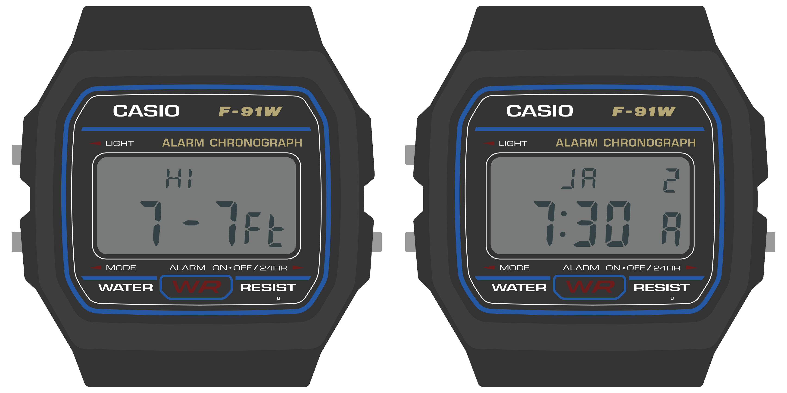

Watch Interface Guidelines (WIG)
================================

This document outlines best practices for developing watch faces for Movement, the community firmware for the Sensor Watch. While this is a rather specific scope, many of these concepts will be relevant to writing a bare-metal Sensor Watch app as well. After reading this document, you should have a sense for the hardware capabilities and limitations of Sensor Watch, the kinds of applications that are well-suited to the hardware, and the interaction models that tend to make for a rich and usable watch face.

Before we get to details, there are two major points that underly every piece of guidance in this document:

#### Sensor Watch is a watch

You'll wear Sensor Watch on your wrist, and you'll interact with it to answer questions about your day and the world around you. “When does the sun set this evening?” “How late is it in Berlin right now?” “What's the high tide today?” These are the kinds of questions that Sensor Watch can excel at answering quickly and clearly.

*Example: a tide prediction app, showing the time of the high tide and its predicted height.*

Even when you add sensors like a thermometer, light sensor or accelerometer, you should think about how your watch face can answer these kinds of simple questions. “How cold was it last night?” “What shutter speed should I use for this photo?” “Was I active enough today?”

Keeping these prompts simple keeps the focus on the things that Sensor Watch can do well, because:

#### Sensor Watch is not a smart watch

While Sensor Watch can have sensors added to it to measure things like temperature, light or acceleration, it's not generally designed to synchronize these measurements to another device like a smart phone; in fact, by default, it has no way of syncing data to or from a device. This makes Sensor Watch less well suited to answering complex questions with that require external data or a longer data trail; questions like “Will it rain tomorrow” require data the watch does not have, and questions like “How active was I last month?“ may be too complex to answer on a small watch with only a few buttons.

There are three key hardware differences between Sensor Watch and a smart watch:

* Whereas a smart watch has a high-resolution screen capable of displaying arbitrary graphics, Sensor Watch has a segment LCD with a fixed layout.
* Whereas a smart watch generally has a touch screen, Sensor Watch has just three buttons for input: the Light, Mode and Alarm (Wake) buttons.
* Whereas a smart watch has powerful processor and a battery that can be recharged daily, Sensor Watch has a much simpler processor, and a battery that must be discarded and replaced.

These differences have implications for how a watch face displays content, how the wearer will interact with a watch face, and how the watch face goes about running its logic:

* You will need to think carefully about how to format the information you want to display and make it work within the constraints of the segment LCD layout.
* You will need to make the most of the limited button inputs, especially since all of these buttons have default functions like changing the mode or illuminating the LED.
* You must take care to ensure that your watch face does not consume too much battery power. In addition, your watch face must be able to work gracefully with Movement’s low energy mode.

Road Map
--------

This document is divided into five sections. First, we'll talk about [the "big picture" stuff](wig/bigpicture.md): some of the concepts you should keep in mind when designing watch faces for Sensor Watch, some of what it does well, and some of what it doesn't. Next, we'll have three sections dedicated to each of those three key areas of functionality: the display, the buttons, and the low-power microcontroller. Finally, we'll bring all of these concepts together to make a very simple watch face that says hello.
