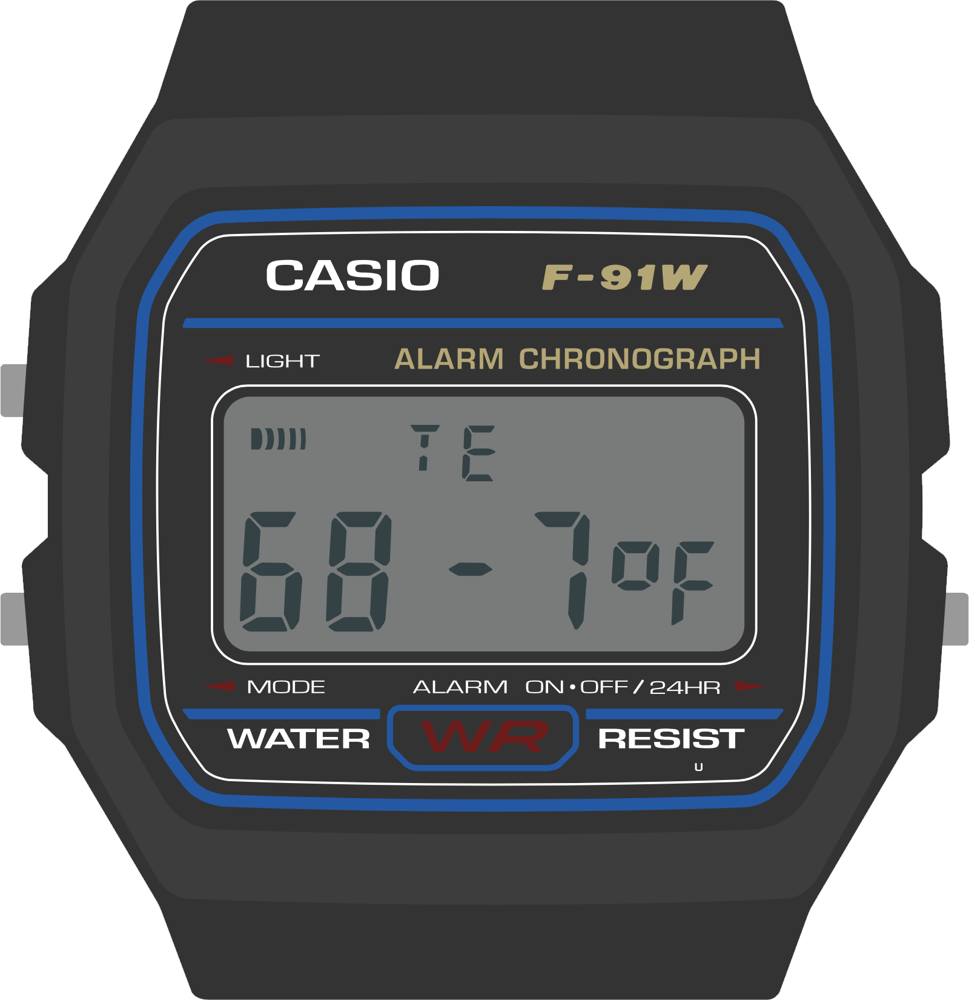
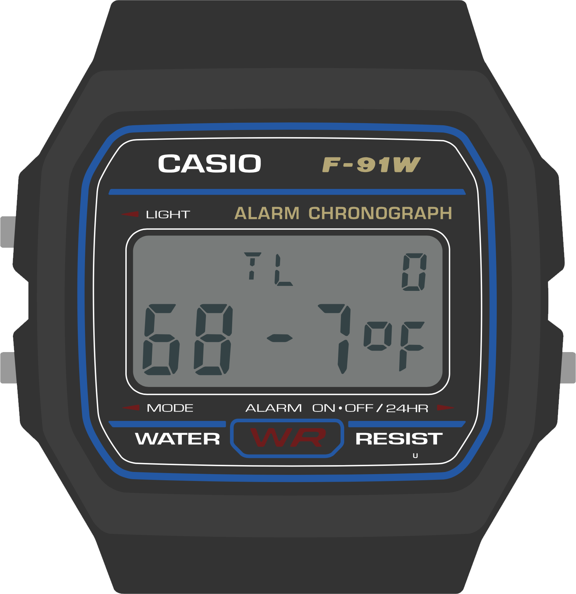

Big Picture Stuff
=================

The Casio F-91W, the donor watch on which Sensor Watch is based, is one of Casio's smallest and simplest wristwatch designs. It is designed to show very basic information: the date and time. As we walk through the device's hardware capabilities, we can see how it is tailored carefully to that use case:

* It has a small segment liquid crystal display with ten digits.
* It has a dim backlight on the left side of the display that mostly illuminates the hours and minutes.
* It has a buzzer for firing a single alarm, as well as an hourly alert.
* The three buttons on the watch offer very basic inputs:
    * the "Mode" button cycles through the four modes that the watch offers;
    * the "Light" button illuminates the watch face,
    * and the "Alarm" button is the only truly multi-function button: it changes which alarms are set when the alarm face is active, and swaps the main 12/24 hour mode when the main clock is active.

Sensor Watch inherits many of the same hardware limitations of the F-91W: the screen is small, the layout is designed to display no more than ten characters at a time, and we have only those three buttons to work with (one of which is dedicated to switching modes). This leads to some broad guidelines that will be useful to think about when designing your watch face:

* Your watch face's main interface should focus on presenting a single screen of useful information.
* If possible, your most important information should appear on the left side of the screen, since the LED will illuminate the left side more brightly than the right.
* You should feel free to use every character position and every indicator segment to its maximum potential! You have ten characters to work with; use them to the fullest.
* If you have more than one screen of information to display, you should hide it behind a press of either the "Alarm" or "Light" buttons...
* ...because your watch face should be prepared to resign immediately when the wearer presses the "Mode" button. (More on this in the "buttons" section!)

Let's look at some of the watch faces that come with Sensor Watch to see how these are implemented in practice.

The Temperature Watch Face
--------------------------

This is the Temperature watch face. It displays the current temperature, as read from a thermistor voltage divider on a Sensor Watch accessory board.

This watch face, while simple, is dominated by a single large piece of information: the current temperature. The wearer is able to absorb this information quickly and easily. The temperature data itself is left-justified; if the LED only illuminated the first two digits, the wearer would at least know the temperature is in the range of 68 degrees; the fractional part, while useful, is not essential to a quick read of the temperature.

Also note that the "signal" indicator segment, used on the main watch face to indicate the status of the hourly beep, is here repurposed to indicate when a new reading is being taken. Don't be afraid to use these indicators for your own purposes; whereas the bell indicator might signal that an alarm is enabled on an alarm watch face, you may want to use it to signal an error or warning condition on another face.

The temperature display face is relatively simple; let's take a look at a more complex watch face.

The Temperature Log Watch Face
------------------------------

This watch face stores a 36-hour log of temperature values, which the wearer can read back to get a sense of high and low temperatures. This seems at first glance like it might be a formidable challenge for a watch face with only ten digits, but by thinking carefully about the design, we can fit a lot of information on this small screen.

Let's revisit the first guideline. This screen displays a useful, information-dense readout of the most recent temperature logged: the "TL" indicates the mode, and the "0" at the top right indicates that this is the zeroth (i.e. most recent) reading taken. The whole bottom line is dedicated to a large, clear display of the logged temperature.

For clarity, it would be nice for this screen to display not just the index of the temperature reading, but also the time that the temperature reading was taken. There isn't room for that on the display, but by pressing the "Light" button, the wearer can temporarily move the watch face into a mode that displays the timestamp of the reading.

This mode simply displays the timestamp for a second or so (this reading was taken at 12:00 AM on the 25th day of the month), and then returns the wearer to the temperature reading at that timestamp. This is a simple way to stack two aspects of the data point into one screen. If you had multiple aspects (say, temperature, humidity and timestamp) you might consider using the light button to cycle through the three screens.

So that handles the most recent temperature and timestamp. But what about our 36 hour log? The answer there lies in the other button, the "Alarm" button. Pressing the "Alarm" button moves one index back in the list of readings.

Once again, we've managed to fit more information onto the screen by hiding it behind a button press. The index at the top right makes clear that this is data point 1 (not data point 0), and again, pressing the "Light" button on this screen will display the timestamp for this reading: 11:00 PM on the 24th:

Repeated presses of the "Alarm" button move the wearer back in time, and at any time the wearer can press the "light" button to view the timestamp. And of course, the wearer can press "Mode" at any time to move from the temperature log face to the next face in the list.

Generally speaking, you should use the "Alarm" button to move through time or advance values, and use the "Light" button to move between sub-modes within the watch face. The "Time Set" watch face, for example, uses the "Light" button to move between setting the hour, minute and second, and uses the Alarm button to change the value in each field.

Wrapping Up
-----------

When designing watch face visuals for the Sensor Watch, you should aim to present one screen of content with clarity:

* Don't shy from information density; use as many digits and indicators as you need.
* Try to fit more crucial information on the left side of the screen, and put less pressing information on the right.
* Don't worry about how segments or digits are used on other watch faces; when your watch face is on screen, you are in control.

When designing interactions for the Sensor Watch, you should aim for consistency with other watch faces:

* Your watch face should resign immediately when the "Mode" button is pressed and pass control to the next watch face in the list.
* If your watch face has multiple modes, you should use the "Light" button to toggle or advance through them.
* If your watch face presents multiple data points or advances through multiple values, you should use the "Alarm" button to advance through those.
