How We Got To Blinky: A Tour of the Sensor Watch Circuit Board
==============================================================

It's funny: I didn't set out to become a watchmaker, or for that matter to build wearable tech. I didn't get into hardware for the gadgets at all. I got into it because I wanted to understand the objects that surround us. We live in a world where slabs of glass and silicon arrive fully-formed in our lives, and there's a temptation to view them as magic. But there's no such thing as magic: every gadget that is was made, and made by folks like you and me. That means that they can be understood by folks like you and me.

Sensor Watch is an aggressively simple design  partly to keep costs down, but mostly to make it a comprehensible object. There are just fifteen unique parts on the circuit board, which means that in the space of a few short paragraphs, you can read a little bit about each one and get a sense for how they come together to create a hackable hardware platform you can wear on your wrist.

That's what we're going to do today.

### Prologue: Power and Ground

Before we do, a preface: if we're going to start from first principles, we need to first talk about power. In any electronic gadget, _current_ flows from one place to another place, and (hopefully!) does useful stuff in between. In the case of Sensor Watch, current is flowing from the positive side of our coin cell to the negative side. 

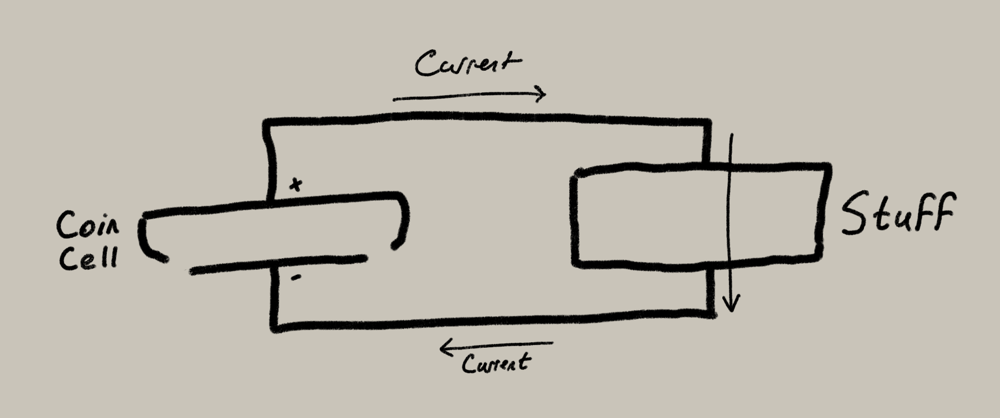

The reason I put this bit in a prologue is that the part that connects the battery to the circuit board isn't on our circuit board at all. It involves two parts that are inside the Casio watch that you already own.

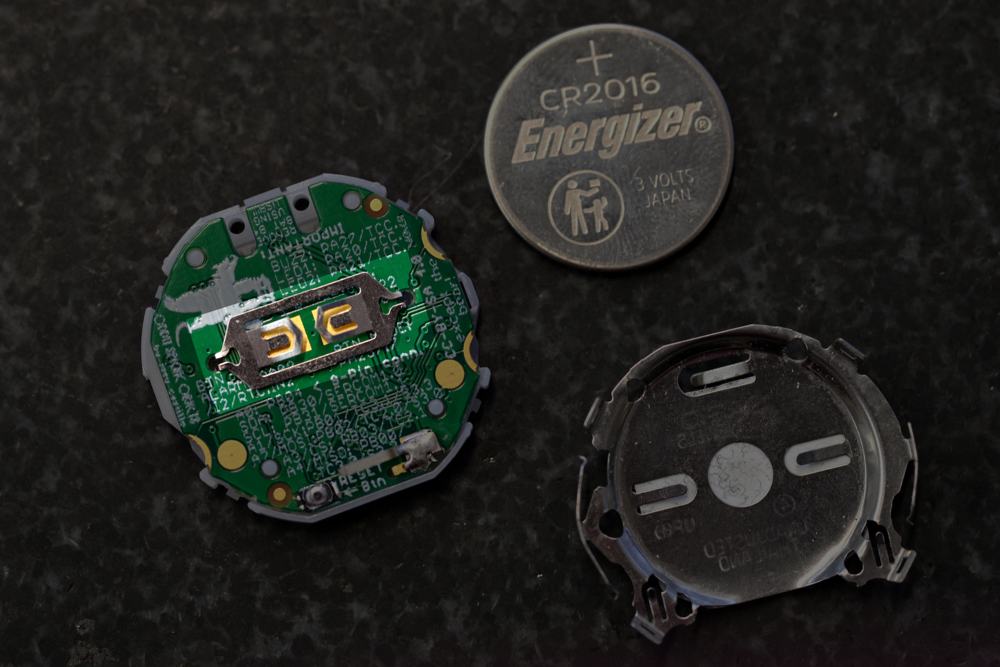

You'll see that the negative bottom side of the coin cell touches that metal battery contact, which touches the square ground pads on the back of the F-91W's circuit board (the gold bits just underneath). 

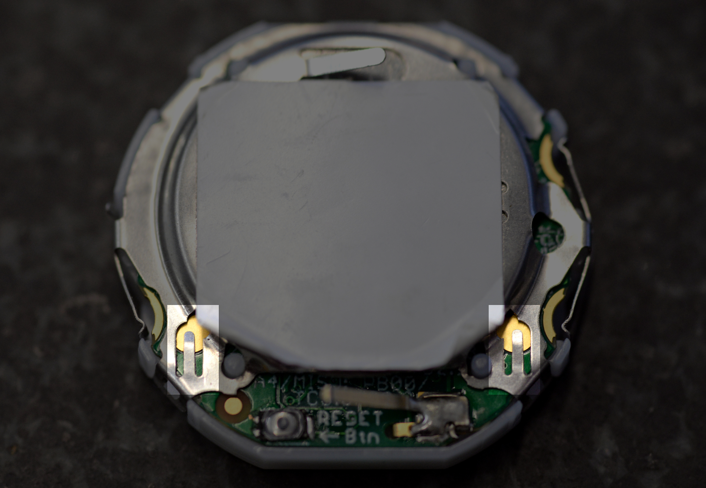

The positive top side of the battery touches the metal retaining clip which, when clipped in, touches those two round power pads on the board. This is how Sensor Watch gets power when it's on your wrist!

### Part U1: The SAM L22

If you look closely, each part on the circuit board has a little letter and number next to it. That's how we're going to refer to them. U1 is the big chip that dominates the center of the board: it's a _microcontroller_, which means it's basically a tiny computer bundled into one package. It's got storage, it's got RAM, and it has a ton of peripherals inside that let it do things like blink a green LED or display the word "green" on an LCD.

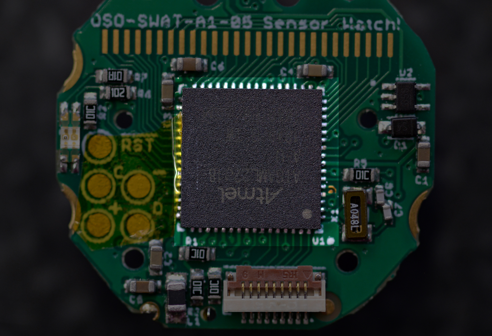

We could talk about this one for days, but for now, trust me when I say that it's the brains of the operation, and most of the _traces_ emanating from it — those little wires underneath the green layer — connect it to the components it's in charge of.

### C1, C2, C3 and C4: Decoupling Capacitors

OK, so this one involves going back to the preface. Remember when I said current flows from one place to another place? That's true, but it also flows at a certain, for lack of a better term, "pressure". We call that _voltage_, and for our tiny computer, it's really important to keep that voltage steady. The thing is, when stuff turns on and off, the voltage level fluctuates.

Have you ever been washing your hands in a restroom when someone flushes a toilet in one of the stalls? Noticed how the pressure from the faucet sometimes drops when that happens? That's a lot like what would happen here if we lit up the LED brightly: the voltage level from the battery would drop. What's worse, if we flashed it on and off really quickly, the voltage level would start to fluctuate noisily (imagine all the stalls flushing over and over again).

_Capacitors_ are little tanks of charge you can put near to a component to "decouple" them from noisy goings-on in the rest of a circuit. C1 is a big and bulky capacitor that's meant to smooth out any big dips or jumps in voltage. C2, C3 and C4 are smaller capacitors, placed near each of the microcontroller's power inputs, to filter out any localized noise.

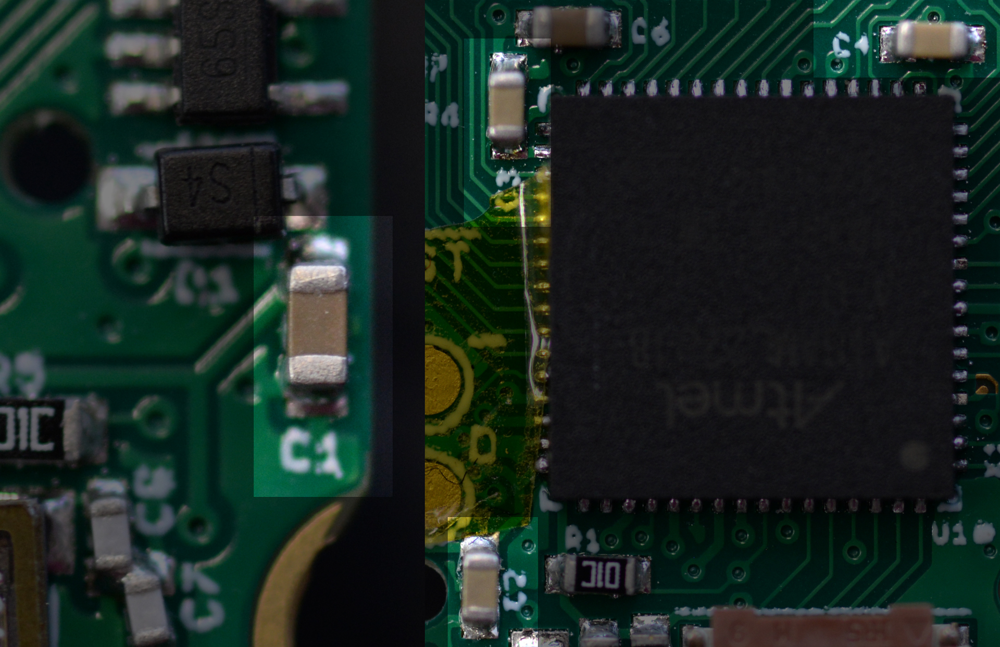

_TODO: redo this image as one photo, not two._

You can imagine C1 as a water tower on top of the building, and C2, C3 and C4 as water tanks attached behind each toilet and faucet, to give them a little local reservoir. Now it would take a lot more flushing to cause problems!

### C5 and C6: Stabilizing other voltages

It would be easy if there were only one voltage level in a circuit, but in Sensor Watch, there are three. While the microcontroller itself runs off of 3 volts, the core CPU runs at just 1.2 volts. And while the microcontroller can generate that voltage level, it needs a little bit of help keeping it stable. C5 is there to stabilize the core voltage.

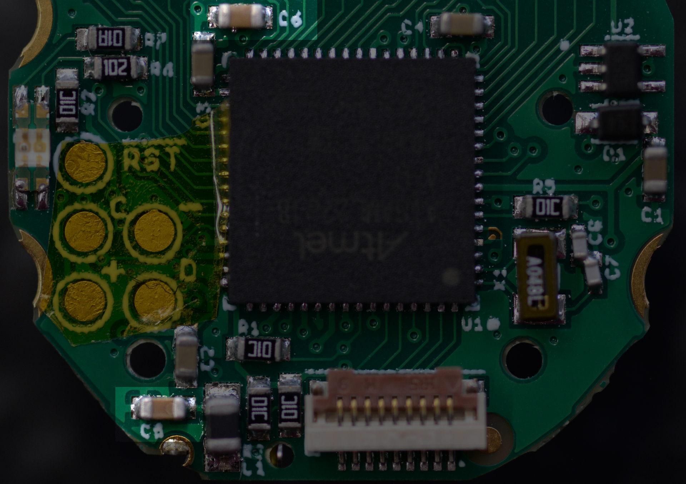

The LCD, too, runs at a different voltage level. The microcontroller has a pump inside that boosts the battery voltage to 3.44 volts to drive the display, but it too needs some help. C6 keeps the LCD voltage steady.

### L1: The Inductor

As long as we're talking about the core, let's talk about L1 down at the bottom. I mentioned above that the microcontroller can generate the 1.2 volts for the core CPU from the 3 volt input. That's true, but it can do it two different ways. The first way is using what's called a "linear regulator". That method essentially burns off the excess voltage as heat to supply the core with its 1.2 volts. That works, but it's not the most efficient way to do it; the heat is just wasted energy, and we're trying to use as much of the coin cell's energy as possible for useful stuff.

The better method involves switching the higher voltage on and off repeatedly to get to the lower voltage. That's more efficient! But it requires an _inductor_.

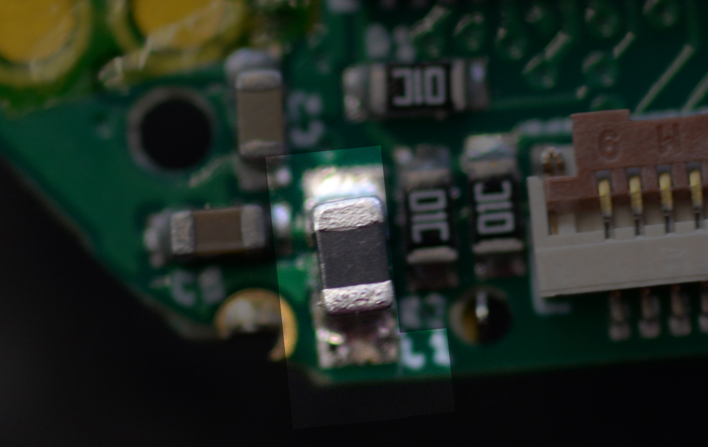

L1 is basically a tiny coil of wire, boxed up in that square package. It stores up energy in a magnetic field when switched on. Then, when switched off, that magnetic field collapses and generates current. By timing that on-off switch carefully, the microcontroller can very efficiently generate the 1.2 volts required to run the core.

### U2 and D1: The USB power supply

So far, we've talked about how the watch gets power from a coin cell while in its enclosure. Missing from the conversation is the fact that you have to take the Sensor Watch board out of its enclosure to program it over USB. Moreover, it's mechanically impossible to plug the board in while attached to a battery.

We need a second way to power the board.

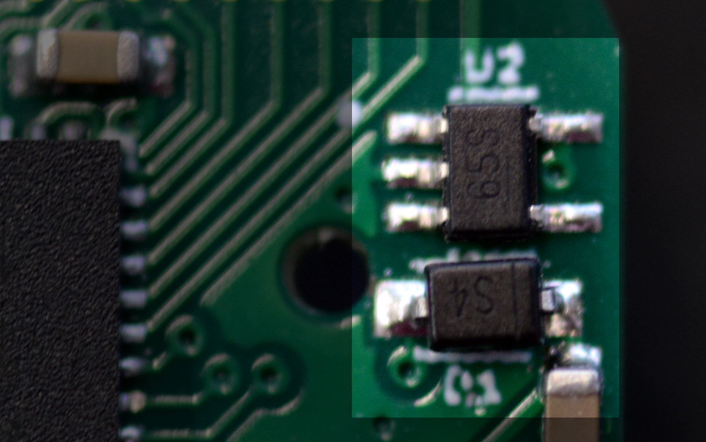

U2 is a Microchip MIC5365 _voltage regulator_. It takes 5 volt power from the USB port at the top of Sensor Watch, and regulates it down to 3.3 volts. This chip is a linear regulator, which you already know means it's less efficient than a switching regulator would be. But we only use it when plugged in to a computer, so there's no way for this inefficiency to drain our precious coin cell.

D1 is a _diode_ separating the 3.3 volt output from the board's main power. A diode is like a one-way sign for current. In this case, when we're running on battery power, it prevents any current from flowing back into stuff in the regulator, wasting precious energy. Note that the diode causes a small, constant voltage drop, so the microcontroller technically gets slightly less than 3.3 volts when plugged in to USB. That doesn't really matter, though; the SAM L22 is happy to operate as low as 1.62 volts.

### R5, R6 and R7: Current Limiting Resistors (and the LED)

So, we talked earlier about how current flows in a circuit. The thing is, you want the right amount of current to flow in the right ways. Sometimes you need less current flowing, sometimes more. A _resistor_ limits the amount of current that can flow. Imagine it like a kink in a garden hose: the more kinked it is, the less water flows. In this case, we have three differently sized resistors, but they're all meant to do the same thing: limit the flow of current.

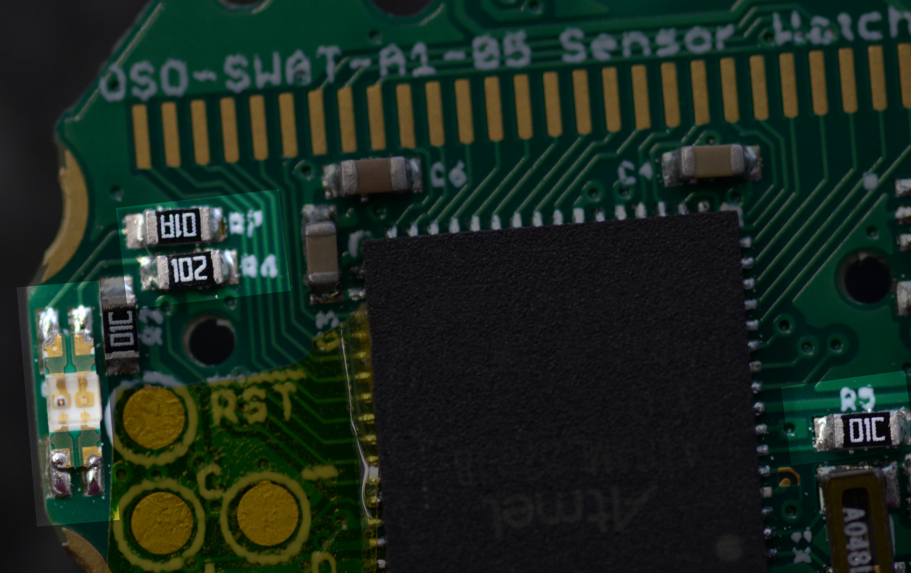

R5 is a 10,000 ohm resistor — a fairly big kink in the hose. It's there to address a need we have: we want to know whether the board is plugged in to a USB port. This is useful to avoid wasting power trying to talk to a computer when we're on battery. So we want to connect U2's regulator output to an input pin. But because that voltage is 3.3 volts, and the microcontroller is getting slightly less than that, we put a 10,000 ohm resistor in between to ensure that we can read the voltage without any significant current flowing into that pin.

R6 and R7 limit the current flowing to the green and red LED's. They have smaller values, though, to let more current flow — and more current is good here, because more current means a brighter light. R6 is 1,000 ohms, and R7 is 100 ohms. This is because the green LED is significantly more efficient than the red LED, which means we can drive it just as bright while consuming less power!

Note that on the blue Special Edition boards, these are labeled R8 and R9, and they're both 100 ohms. This is because the blue LED is not as efficient as the green LED. (Looks cool, though!)

### R1, R2, R3 and R4: Pull-up Resistors (and the Reset Button)

For the record, I'm using a different term for these four 10,000 ohm resistors, but they're all just plain old resistors; the difference just lies in what we're using them for. In this case, we're using these resistors to "pull" a pin up to 3 volts.

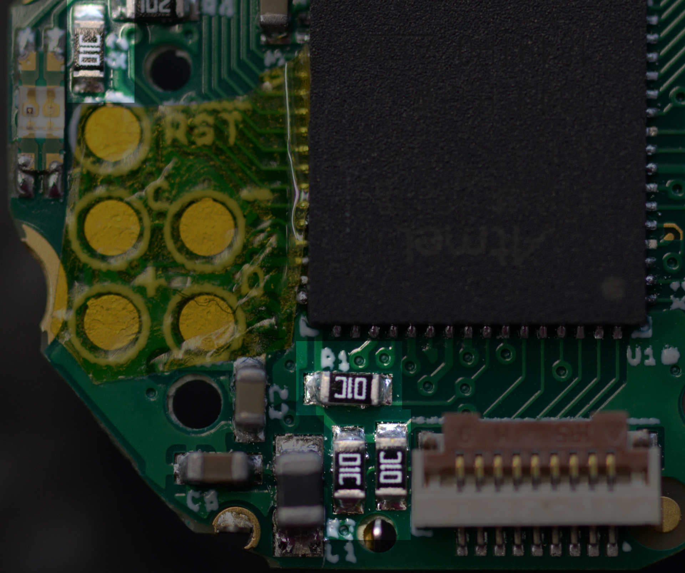

Why does this matter? Different reasons. In the case of R1, there's a special pin on the SAM L22 that's used for debugging the chip, and it can go low to enter that debug mode. If that happened while you were wearing the watch — maybe in response to some noise in the environment like a nearby electric motor — the watch would stop working. R1 pulls this signal up to 3 volts so that it stays reliably high. R2 does the same thing for the Reset pin: when that pin goes low, the watch resets, and you wouldn't want the watch to reset accidentally.

You might be wondering: if we need these signals to stay high, why not just connect them straight to 3 volts? Why use a resistor? The answer is, sometimes we do need them to be low. For example, you may want to press the reset button (it's on the back) when programming the watch. If the reset pin were tied to 3 volts, pressing the button would cause a _short circuit_ — letting current flow directly from power to ground. Having this resistor in between means that when you do press the button, the pin can go low without short circuiting the board: current still flows from power to ground, but only a little bit.

R3 and R4 (at the bottom) pull up the two lines of the I2C bus. This is relevant for sensor boards: there are some chips you can put on a sensor board that can speak a special language to communicate with the watch. These chips require the wires they use to be pulled up, so we do that here. This means you don't have to waste space putting them on your sensor board!

### X1, C7 and C8: The Quartz Crystal

The core feature of a watch is its ability to tell time, and this circuit is how Sensor Watch does it. X1 contains a tiny quartz crystal in the shape of a tuning fork that's tuned to precisely 32.768 hertz (pulses per second). That means that when you zap it with electricity, it begins to oscillate at that frequency. That oscillation creates a signal, and the microcontroller uses that signal as a clock! There's a peripheral inside the microcontroller that's designed to divide this signal: dividing it by two gives it a 16384 Hz signal; dividing again, 8192 Hz. Dividing it further and further eventually yields a 1 Hz pulse — perfect for ticking the seconds on the watch!

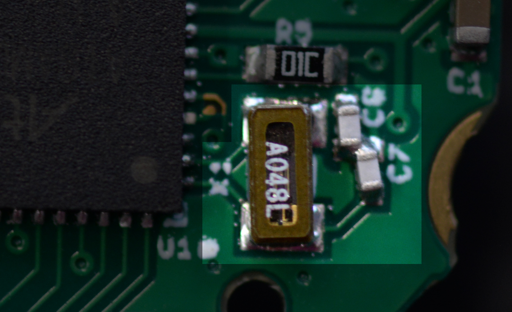

You might ask, what's with the two capacitors, C7 and C8? They're what's called "load capacitors": basically, the microcontroller zaps the crystal to start it oscillating, but it would stop oscillating pretty quickly without a continued push. These capacitors continually give the crystal that little push to keep it vibrating at its resonant frequency.

### J1: The Sensor Board Connector

This is it, the last part on the board! So far, we've described a watch that can tell time, blink lights and talk to a computer. This nine-pin sensor board connector is how it can sense things about the outside world. This one, again, we could talk about for days, but suffice it to say it breaks out seven pins from the microcontroller, plus power and ground. Five of the pins are capable of reading analog signals (voltages from 0-3 volts), and six of them can also be used to talk to digital gadgets like sensors and memory chips.

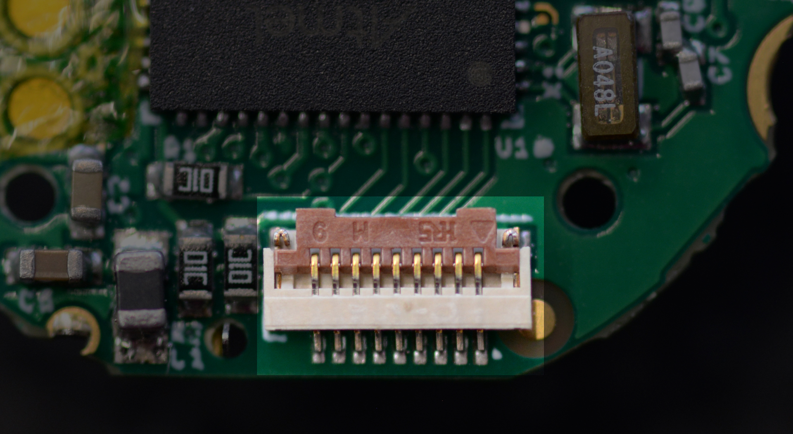

As it stands, Sensor Watch ships with a temperature sensor board, which uses two pins: one to enable the temperature sensor, and another to read the analog value indicating the temperature. But you're not limited to that; one could build all kinds of interesting sensor boards and plug them in to Sensor Watch!

### Epilogue: the Display and the Buzzer

You may have noticed two interesting omissions from all of this: we never talked about how we put things on the screen or make the watch beep! This is fun, because like the battery bits in the prologue, these rely on parts that come from the donor watch. First, let's talk about the display, and that row of exposed pads at the top of the Sensor Watch board:

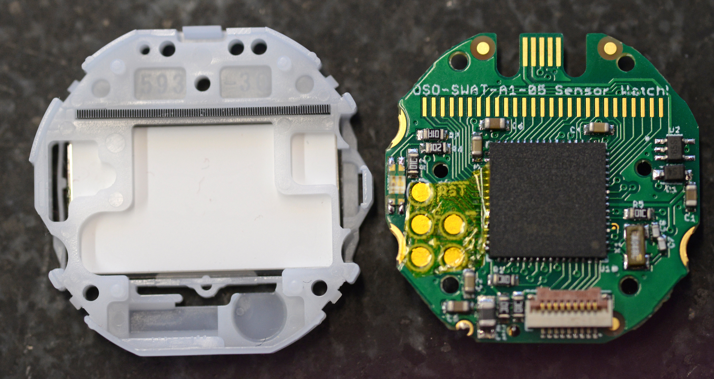

These are the lines the microcontroller uses to talk to the display, but you'll notice that while all of them are tied directly to the microcontroller, they aren't tied to anything else! At least, they're not when the board is outside of its enclosure. But take a closer look at that enclosure. Imagine those pads making contact with that gray strip at the top:

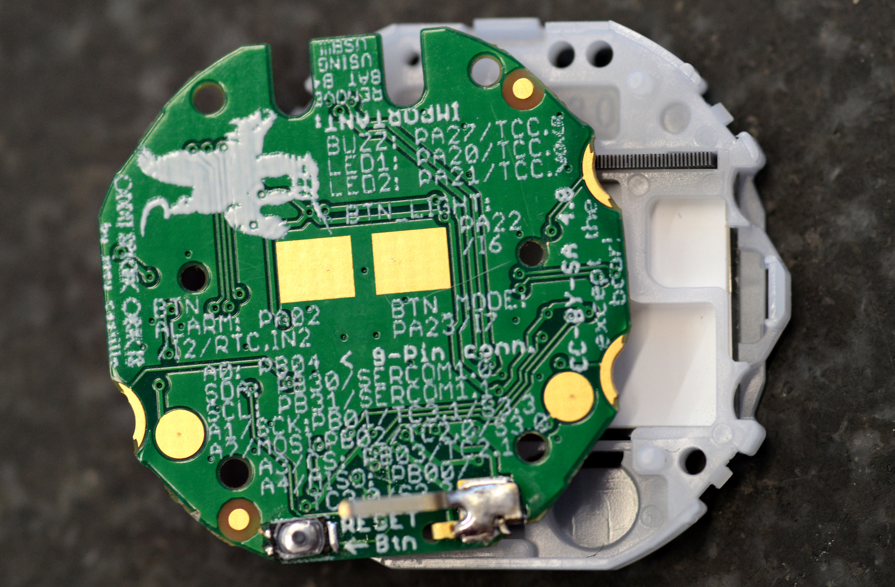

This elastomer strip, a part of the original Casio watch, creates a vertical connection between the glass LCD screen and the pads on the Sensor Watch circuit board. It's a terribly clever solution to the question of how to connect these two pieces — one that Sensor Watch inherits from the original design of the Casio F-91W.

The F-91W's buzzer does something similarly clever, in that there is no buzzer on the Casio F-91W circuit board. The buzzer is embedded in the back plate of the watch:

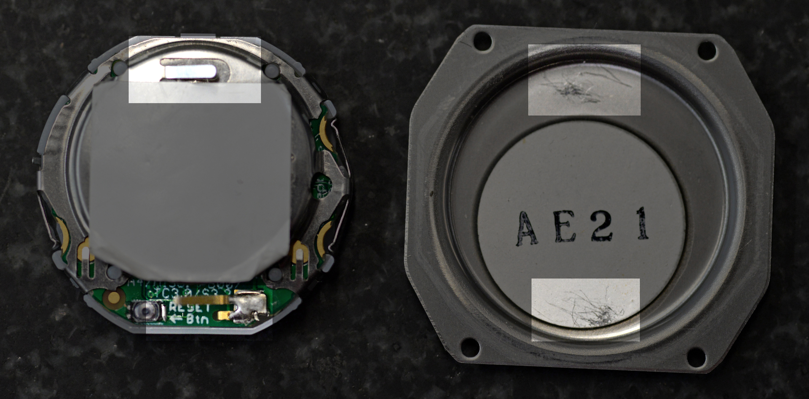

Note the tab sticking up from the retaining clip, as wel as the tab sticking up from that big blob of solder at the bottom. When the watch is in its enclosure, pressure connects those two tabs to the backplate, and the big circle glued to the inside of the backplate (the piezo buzzer). Again, clever: gluing the buzzer to the back of the case lets the watch use a much larger surface area for extra volume. Moreover, being attached to the outside instead of buried inside means that more of that sound makes it to your ears. 

Alas, this metal clip means that getting the Sensor Watch to beep involves a tiny bit of soldering: you have to desolder that little metal tab from your donor watch, and solder it to the same spot on Sensor Watch. Being custom to the F-91W, it's the one part that I couldn't order from Mouser and solder for you.

[TODO: Video?]

Note that you can still use Sensor Watch just fine without this soldering job; it just won't beep. Having said that, I hope you do give it a try. The Sensor Watch circuit board will arrive mostly formed in your life, but now that you understand it, I hope you can feel comfortable making it your own.

Backer Questions
----------------

* A158 compatibility?

Other News of the Watch
-----------------------

TODO:

* Sunrise/sunset
* Buzzer in simulator
* Nearing a final panel for sensor boards